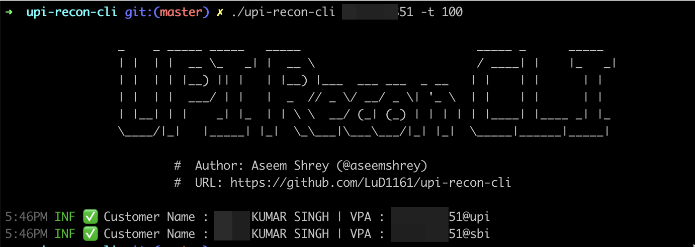
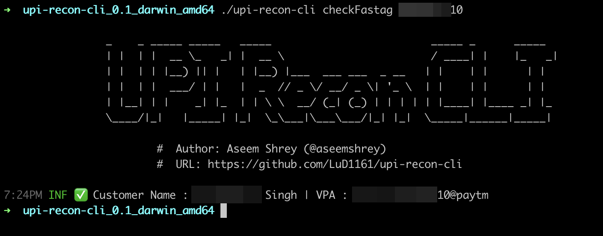
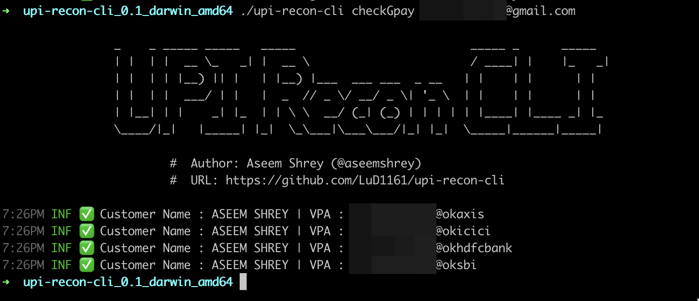

# UPI Recon CLI
 

A command line tool for reconnaissance using virtual payment address (VPA).
This tool leverages the openness available with the UPI platform to find :
1. UPI ID and name associated with a mobile number
2. UPI ID and name associated with a gmail account
3. UPI ID and name associated with a vehicle registration number. Leveraging UPI id associated with a FASTag.

This project is a golang port of [upi-recon](https://github.com/qurbat/upi-recon/) by [@squeal](https://twitter.com/squeal).

# Overview

```sh

		_    _ _____ _____   _____                         _____ _      _____
		| |  | |  __ \_   _| |  __ \                       / ____| |    |_   _|
		| |  | | |__) || |   | |__) |___  ___ ___  _ __   | |    | |      | |
		| |  | |  ___/ | |   |  _  // _ \/ __/ _ \| '_ \  | |    | |      | |
		| |__| | |    _| |_  | | \ \  __/ (_| (_) | | | | | |____| |____ _| |_
		\____/|_|   |_____| |_|  \_\___|\___\___/|_| |_|  \_____|______|_____|

			#  Author: Aseem Shrey (@aseemshrey)
			#  URL: https://github.com/LuD1161/upi-recon-cli

Check virtual payment address corresponding to a mobile number, email address and get user's name as well.

Usage:
  upi-recon-cli PHONE_NUMBER [flags]
  upi-recon-cli [command]

Available Commands:
  checkFastag Check FASTag suffixes for vehicle registration number.
  checkGpay   Check gmail id corresponding to GPay suffixes.
  help        Help about any command

Flags:
  -c, --config string   config file (default "config.yaml")
  -h, --help            help for upi-recon-cli
  -t, --threads int     No of threads (default 100)
      --timeout int     Timeout for requests (default 15)

Use "upi-recon-cli [command] --help" for more information about a command.****
```

### Checking a Mobile number for the Owner's name and UPI IDs
```sh
./upi-recon-cli <MOBILE_NUMBER_HERE>
```


### Checking a Vehicle Number for the Owner's name and UPI IDs
```sh
./upi-recon-cli checkFastag <VEHICLE_NUMBER>
```



### Checking a Gmail ID for the Owner's name and UPI IDs
```sh
./upi-recon-cli checkGpay <GMAIL_ID>
```



## Installation

1. Download the binaries for your platform from [releases page](https://github.com/LuD1161/upi-recon-cli/releases).
2. Extract the `tar.gz` file.
You'd find the following file strucuture inside the extracted folder : 
```sh
.
├── README.md
├── data
│   ├── fastag_suffixes.txt
│   ├── gpay_suffixes.txt
│   ├── test_suffixes.txt
│   └── vpa_suffixes.txt
├── config.yaml.sample
└── upi-recon-cli

1 directory, 7 files
```
3. Rename the `config.yaml.sample` file to `config.yaml` and add the razorpay live api key into it. 
Please [refer to the documentation](https://razorpay.com/docs/payments/dashboard/settings/api-keys/) provided by Razorpay in order to generate valid live API credentials.
<br/>**Note**: Razorpay `test` credentials will not work.
4. That's it. You're ready to go 🎉🚀
## 🚀 About Me

This is [Aseem](https://aseemshrey.in). I'm a security engineer from India 🇮🇳.<br/>I am always curious about learning and building new things. Teaching security stuff through my youtube channel. Ping me up for anything related to security 🙌


<a href="https://twitter.com/intent/follow?screen_name=AseemShrey" target="_blank"></a>
<a href="https://youtube.com/c/HackingSimplifiedAS?sub_confirmation=1" target="_blank"></a>
