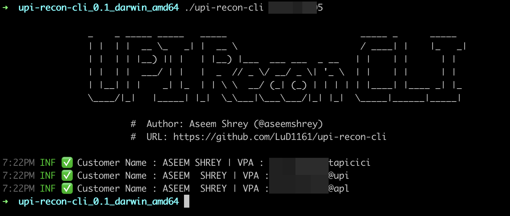

# UPI Recon CLI
 

A command line tool for reconnaissance using virtual payment address (VPA).
This tool leverages the openness available with the UPI platform to find :
1. UPI ID and name associated with a mobile number
2. UPI ID and name associated with a gmail account
3. UPI ID and name associated with a vehicle registration number. Leveraging UPI id associated with a FASTag.


# Overview

```sh

		_    _ _____ _____   _____                         _____ _      _____
		| |  | |  __ \_   _| |  __ \                       / ____| |    |_   _|
		| |  | | |__) || |   | |__) |___  ___ ___  _ __   | |    | |      | |
		| |  | |  ___/ | |   |  _  // _ \/ __/ _ \| '_ \  | |    | |      | |
		| |__| | |    _| |_  | | \ \  __/ (_| (_) | | | | | |____| |____ _| |_
		\____/|_|   |_____| |_|  \_\___|\___\___/|_| |_|  \_____|______|_____|

			#  Author: Aseem Shrey (@aseemshrey)
			#  URL: https://github.com/LuD1161/upi-recon-cli

Check virtual payment address corresponding to a mobile number, email address and get user's name as well.

Usage:
  upi-recon-cli PHONE_NUMBER [flags]
  upi-recon-cli [command]

Available Commands:
  checkFastag Check FASTag suffixes for vehicle registration number.
  checkGpay   Check gmail id corresponding to GPay suffixes.
  help        Help about any command

Flags:
  -c, --config string   config file (default "config.yaml")
  -h, --help            help for upi-recon-cli
  -t, --threads int     No of threads (default 100)
      --timeout int     Timeout for requests (default 15)

Use "upi-recon-cli [command] --help" for more information about a command.****
```

### Checking a mobile number for the Owner's name and UPI IDs
```sh
./upi-recon-cli <MOBILE_NUMBER_HERE>
```


## 🚀 About Me

This is Aseem. I'm a security engineer from India 🇮🇳.<br/>I love building and teaching security stuff. Ping me up for anything related to security 🙌


 


## Acknowledgements

This project was inspired by [upi-recon](https://github.com/qurbat/upi-recon/) by [@squeal](https://twitter.com/squeal).

